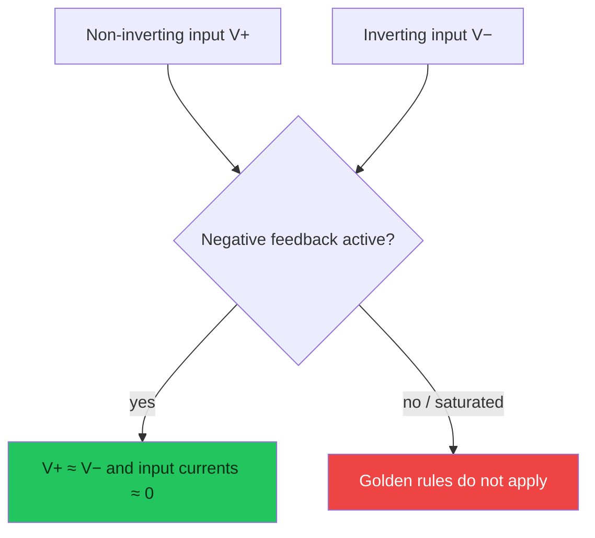
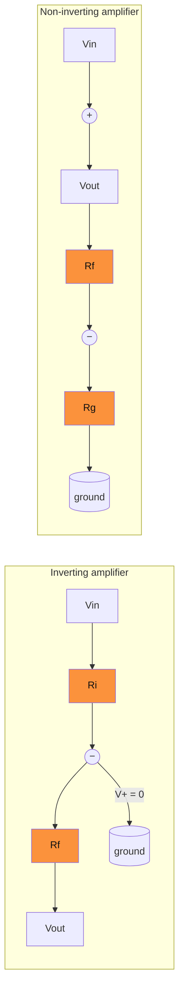
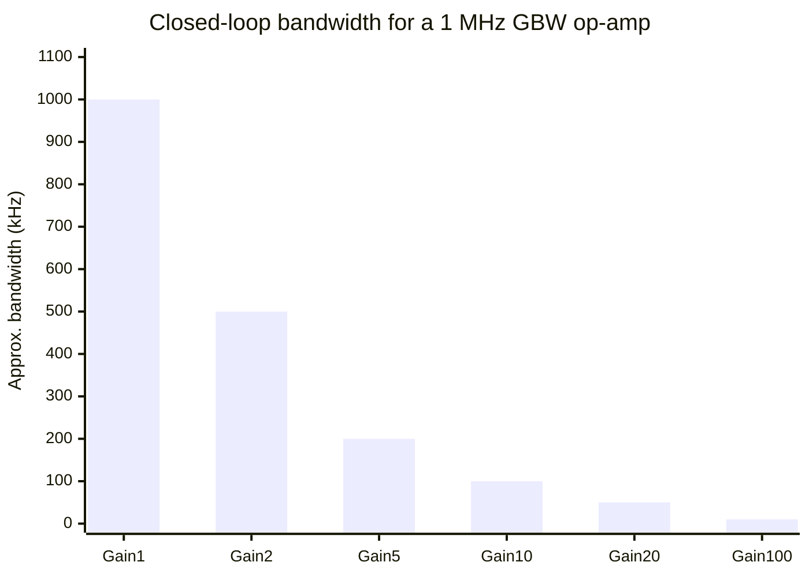
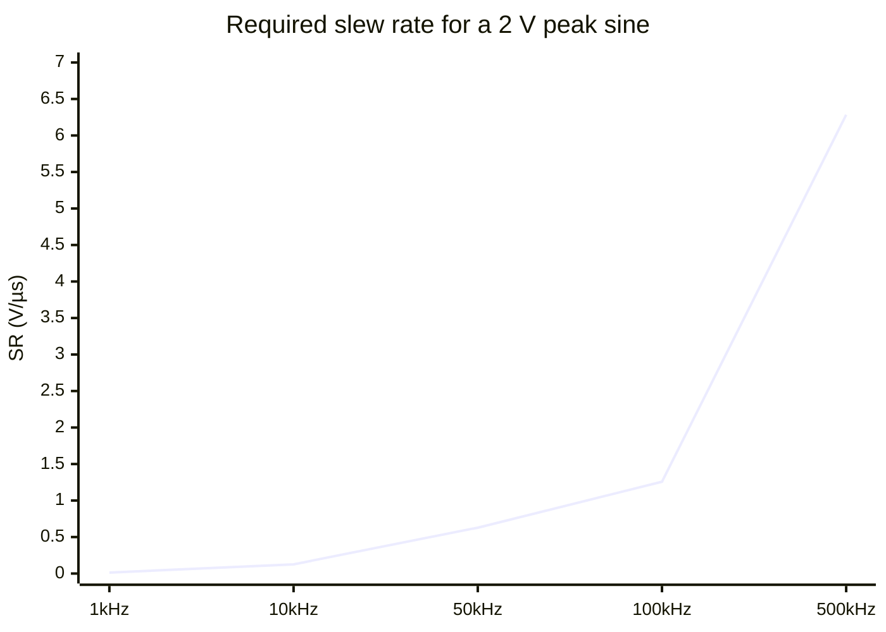

# Operational amplifiers

> [!summary] The one-line model
> An op-amp uses very high open-loop gain plus negative feedback to make a precise closed-loop function.

The ideal op-amp has infinite open-loop gain, infinite input impedance, zero output impedance, and unlimited bandwidth. Real devices approach those assumptions only inside a safe operating region.

## Symbol and feedback loop

For negative feedback, the closed-loop gain is:

$$
A_{CL}=\frac{A}{1+A\beta}\approx\frac{1}{\beta}\quad\text{when }A\beta\gg1
$$

That approximation is the reason resistor ratios—not the uncertain open-loop gain—set most amplifier gains.

## Two golden rules (with a boundary)

1. `V+ ≈ V−` when negative feedback is active and the output is not saturated.
2. `I+ ≈ I− ≈ 0` for a voltage-feedback input stage.

## Common circuits

$$
A_{inv}=-\frac{R_f}{R_i}, \qquad A_{noninv}=1+\frac{R_f}{R_g}
$$

### Gain and bandwidth chart

An op-amp with a 1 MHz gain-bandwidth product cannot provide arbitrary gain at arbitrary frequency.

| Closed-loop gain | Approx. bandwidth | Example resistor ratio    |
| ---------------: | ----------------: | ------------------------- |
|            1 V/V |             1 MHz | Voltage follower          |
|            2 V/V |           500 kHz | `Rf = Rg` non-inverting   |
|           10 V/V |           100 kHz | `Rf = 9Rg` non-inverting  |
|          100 V/V |            10 kHz | `Rf = 99Rg` non-inverting |

## Slew rate and large-signal limits

Bandwidth predicts small-signal behavior. A large sine wave can still distort if its required slope exceeds the slew rate:

$$
SR_{required}=2\pi fV_{pk}
$$

At 100 kHz and 2 V peak, the amplifier needs at least 1.26 V/µs, plus margin for tolerances and transient content.

## Stability checklist

- Keep the feedback loop physically short and away from high-current switching nodes.
- Check the data sheet's capacitive-load guidance; a cable can make a follower oscillate.
- Decouple each supply pin with a small ceramic capacitor close to the package.
- Confirm input common-mode range and output swing at the actual supply rails.
- Simulate worst-case resistor tolerance, load, temperature, and source impedance.

> [!tip] Debugging order
> First verify power rails and pinout, then check common-mode range, then probe the feedback node. An op-amp that is out of range can look like a “bad” resistor calculation.

## Worked example

Design a non-inverting gain of 11 from a 5 V single supply. Choose `Rg = 10 kΩ`; then `Rf = 100 kΩ` gives `1 + 100/10 = 11 V/V`. Bias the non-inverting input above ground if the signal is bipolar, and verify the output never needs to swing below the device's valid output range.

## See also

- [Resistors](resistors) for feedback ratios, loading, and noise.
- [Transformers](transformers) for isolation and signal conditioning before an amplifier.
