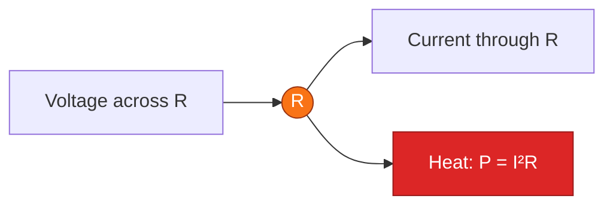
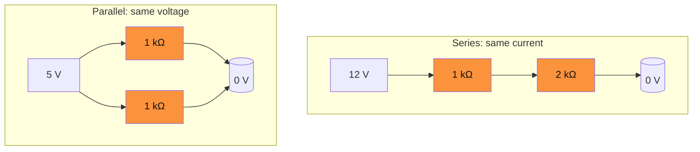

# Resistors

> [!summary] The one-line model
> A resistor converts electrical energy into heat according to `V = IR` and `P = VI = I²R = V²/R`.

Resistors set current, divide voltage, terminate transmission lines, bias active devices, and provide a safe path for stored energy to dissipate.

## Symbols and physical intuition





## Series and parallel rules

$$
R_{series}=R_1+R_2+\cdots, \qquad
\frac{1}{R_{parallel}}=\frac{1}{R_1}+\frac{1}{R_2}+\cdots
$$

For two resistors in parallel, `R₁ ∥ R₂ = (R₁R₂)/(R₁+R₂)`. The equivalent resistance is always lower than the smallest branch.

### Divider chart

For a 12 V source and `R₁ = 10 kΩ`, the divider output is `Vout = 12 × R₂/(10 kΩ + R₂)`.

```mermaid
xychart-beta
  title "Voltage divider output vs. lower leg"
  x-axis [1 kΩ, 2.2 kΩ, 4.7 kΩ, 10 kΩ, 22 kΩ, 47 kΩ]
  y-axis "Vout (V)" 0 --> 10
  line [1.09, 2.17, 3.84, 6.0, 8.25, 9.85]
```

|     R₂ |   Vout | Current | R₁ power | R₂ power |
| -----: | -----: | ------: | -------: | -------: |
|   1 kΩ | 1.09 V | 1.09 mA |  11.9 mW |  1.19 mW |
| 4.7 kΩ | 3.84 V | 0.82 mA |  6.72 mW |  3.15 mW |
|  10 kΩ | 6.00 V | 0.60 mA |  3.60 mW |  3.60 mW |
|  47 kΩ | 9.85 V | 0.17 mA |  0.29 mW |  1.67 mW |

> [!warning] A divider is not an ideal voltage source
> Connecting a load places it in parallel with `R₂`, lowers the equivalent resistance, and pulls Vout down. Use a buffer or lower resistor values when the load is significant.

## Power and thermal headroom

```mermaid
xychart-beta
  title "Power rating and steady-state temperature rise"
  x-axis [0%, 25%, 50%, 75%, 100% rated power]
  y-axis "Temperature rise (°C)" 0 --> 80
  bar [0, 12, 28, 49, 76]
```

The rating printed on a resistor assumes a specified ambient, mounting, and maximum temperature. A useful derating heuristic is to operate at 50–70% of the nameplate power when reliability matters.

$$
T_{resistor}=T_{ambient}+P\theta_{JA}
$$

For a 0.25 W resistor with `θJA = 250 °C/W`, dissipating 0.125 W raises its body roughly 31 °C above ambient.

## Tolerance, noise, and non-ideal behavior

| Property                | What to watch                     | Typical design response     |
| ----------------------- | --------------------------------- | --------------------------- |
| Tolerance               | Actual value differs from nominal | Use 1% parts or trim        |
| Temperature coefficient | Value shifts with temperature     | Use low-TCR metal film      |
| Johnson noise           | `√(4kTRB)` voltage noise          | Lower R or reduce bandwidth |
| Pulse energy            | Short surge exceeds steady rating | Check overload curves       |
| Parasitics              | Lead inductance/capacitance at RF | Use short leads or SMD      |

## Worked example: LED current limit

A 5 V GPIO drives a red LED with a 2.0 V forward drop at 8 mA.

$$
R=\frac{5-2}{0.008}=375\,\Omega
$$

Choose the next standard value, 390 Ω. The resistor dissipates `P = 3²/390 = 23 mW`, so a 0.125 W part has comfortable margin.

## See also

- [Transformers](transformers) for winding resistance and reflected impedance.
- [Op-amps](op-amps) for feedback networks built from resistor ratios.
