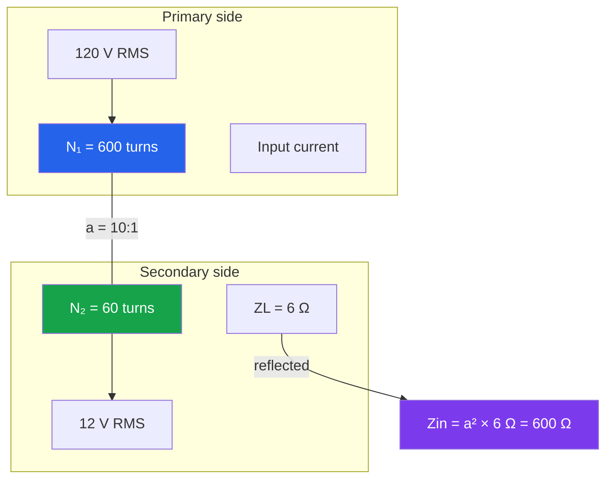
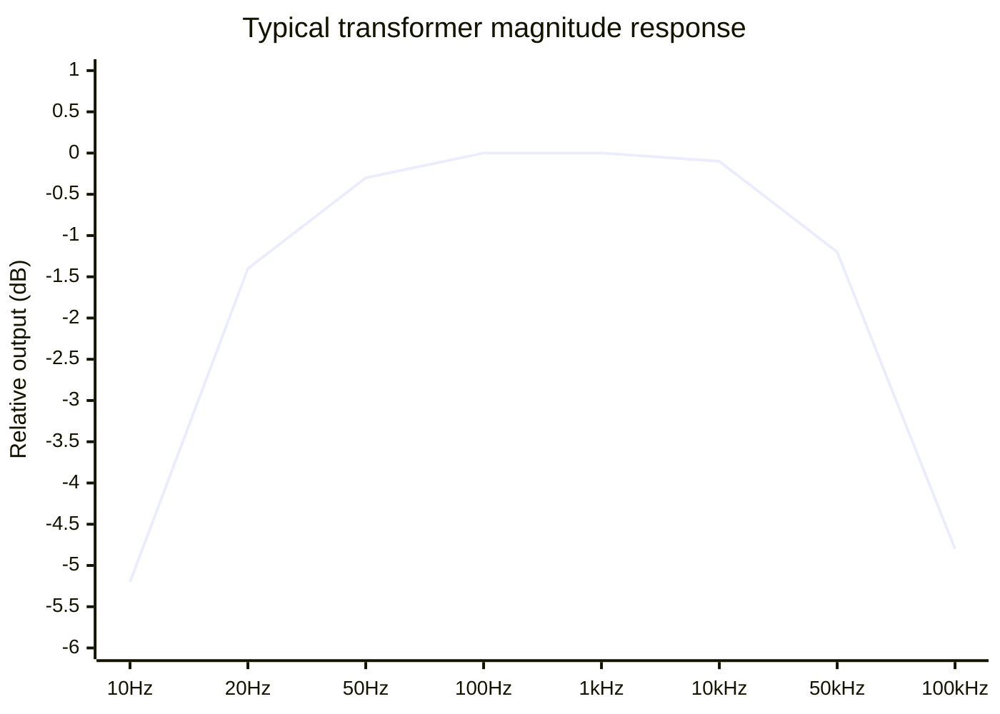

# Transformers

> [!summary] The one-line model
> An ideal transformer trades voltage for current while conserving power: `V₁/V₂ = N₁/N₂` and `I₁/I₂ = N₂/N₁`.

Transformers move energy between circuits through a changing magnetic flux. There is no conductive connection between the windings, so isolation and impedance transformation arrive together.

## Anatomy and energy path

```mermaid
flowchart LR
  AC[AC source<br/>V₁, I₁, f] --> P[Primary winding<br/>N₁ turns]
  P -. changing current .-> C((Core flux<br/>Φ(t)))
  C -. Faraday's law .-> S[Secondary winding<br/>N₂ turns]
  S --> L[Load<br/>V₂, I₂]
  C --> H[Heat + leakage<br/>real-world losses]
  style C fill:#f59e0b,color:#111,stroke:#b45309
  style H fill:#ef4444,color:#fff,stroke:#991b1b
```

The induced voltage follows Faraday's law, `e = N dΦ/dt`. A sinusoidal source therefore needs a changing flux; a DC source saturates the core after the brief switching transient.

## Turns ratio and reflected impedance

For an ideal transformer, define `a = N₁/N₂`:

$$
\frac{V_1}{V_2}=a, \qquad \frac{I_1}{I_2}=\frac{1}{a}, \qquad Z_{in}=a^2 Z_L
$$



The 6 Ω secondary load appears as 600 Ω at the primary. This is why a small transformer can match a low-impedance speaker to a higher-impedance amplifier output.

## Frequency response and regulation

The ideal ratio is flat only over the useful operating band. Leakage inductance and winding capacitance dominate at high frequency; magnetizing inductance and core size dominate at low frequency.



Voltage regulation is the load-dependent drop between no-load and full-load secondary voltage:

$$
\text{regulation}=\frac{V_{NL}-V_{FL}}{V_{FL}}\times100\%
$$

| Operating point | Secondary voltage | Copper current | What it reveals                 |
| --------------- | ----------------: | -------------: | ------------------------------- |
| No load         |            12.6 V |            0 A | Winding resistance is invisible |
| 25% load        |           12.45 V |         0.50 A | Small resistive drop            |
| 50% load        |           12.25 V |         1.00 A | Regulation becomes measurable   |
| Full load       |           12.00 V |         2.00 A | Rated thermal operating point   |

```mermaid
xychart-beta
  title "Secondary voltage droop under load"
  x-axis [0%, 25%, 50%, 75%, 100% load]
  y-axis "V₂ (V)" 11.8 --> 12.7
  line [12.6, 12.45, 12.25, 12.1, 12.0]
```

## Design checks

1. **Volt-seconds:** keep `V·t` below the core's saturation limit. More turns or a larger core lowers flux density.
2. **Copper loss:** estimate `Pcu = I₁²R₁ + I₂²R₂`; both windings need a thermal path.
3. **Isolation:** creepage, clearance, bobbin, and insulation class matter more than the turns ratio.
4. **Inrush:** an unloaded transformer can draw a short, high current when switched near the worst point of the AC waveform.

> [!tip] A practical sanity check
> If the measured secondary voltage is high at no load, do not “fix” it by exceeding the current rating. Check regulation, rectifier drop, and the load's actual duty cycle first.

## Worked example

A 230 V to 18 V transformer supplies a 9 Ω load.

$$
a=\frac{230}{18}=12.78, \quad I_2=\frac{18}{9}=2\text{ A}, \quad I_1\approx\frac{18\times2}{230}=0.157\text{ A}
$$

The ideal input power is 36 VA. Choose a rating above 36 VA to cover regulation, heating, rectifier crest factor, and startup margin.

## See also

- [Resistors](resistors) for winding resistance, divider loading, and power dissipation.
- [Op-amps](op-amps) for active circuits that often follow an isolated or stepped-down supply.
